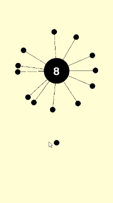
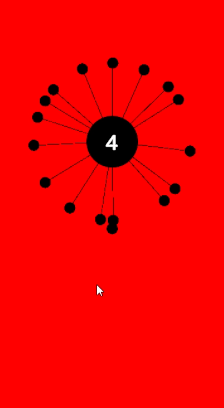

# Shooting-Ball
Click to shoot the ball. To succeed, you need to land the ball on the Target Circle with the number shown. If the ball collides with a ball that is already on the circle, you fail.

    
    

